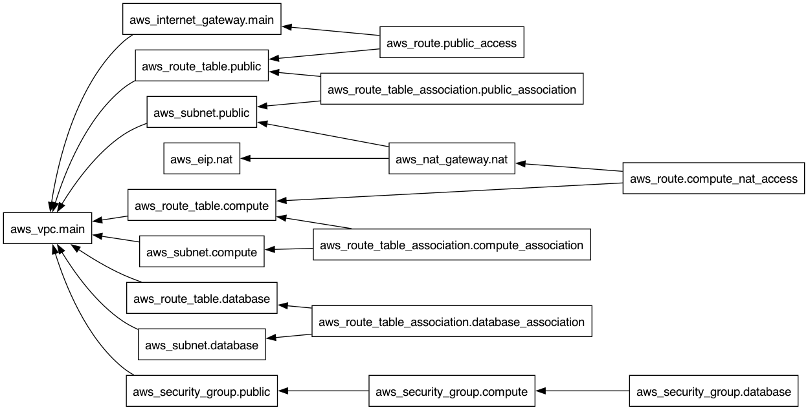

# Terraform Example

This repository contains a simple Terraform example that demonstrates how to use Terraform to manage a simple infrastructure, that contains the following:
- A VPC (Virtual Private Cloud)
- A public subnet
- A compute subnet
- A database subnet

For this project, I used the [LocalStack provider](https://www.localstack.cloud/), which allows you to run AWS services locally (it's an AWS mock basically). This is useful for testing and development purposes without spending money on actual AWS resources.

Additionally, to make everything work seamlessly, I used the [tflocal](https://github.com/localstack/terraform-local) wrapper, which simplifies the process of running Terraform commands against LocalStack.

## Requirements

1. [Terraform](https://developer.hashicorp.com/terraform/tutorials/aws-get-started/install-cli)
2. LocalStack installed and running:
    - [Installation docs](https://docs.localstack.cloud/aws/getting-started/installation/)
    - [`tflocal` wrapper](https://github.com/localstack/terraform-local)

Optional stuff that just makes life easier for testing:

3. [AWS CLI](https://docs.aws.amazon.com/cli/latest/userguide/getting-started-install.html)
4. [awslocal](https://github.com/localstack/awscli-local)

## Thought process

We first start by asking ourselves what we want to achieve with this infrastructure. The answer is simple: we want to have a VPC with a public subnet, a compute subnet that cannot be simply accessed by anyone, but can access the internet, and a database subnet that only services in the VPC can access it. This is a common setup for many applications, and it allows us to have a clear separation of concerns.

To get familiar with Terraform, in case you have not had the chance to work with it before, I recommend you to start with the [Terraform get started guide for AWS](https://developer.hashicorp.com/terraform/tutorials/aws-get-started).

After setting up the provider, we can start defining our resources.

### The VPC

```hcl
resource "aws_vpc" "main" {
  cidr_block = "10.0.0.0/16"
  tags = {
    Name = "main-vpc"
  }
}
```

You might be wondering where do we get the resource name from, and why we are using that CIDR block.

Every resource name is defined by the provider we are using (for AWS see [this](https://registry.terraform.io/providers/hashicorp/aws/latest/docs)), meaning that if you use a different provider, the resource names will be different. For example, the `aws_vpc` resource is used to create a Virtual Private Cloud (VPC) in AWS.

Moreover, the 10.0.0.0/8 block is part of the private IPv4 address space defined by [RFC 1918](https://datatracker.ietf.org/doc/html/rfc1918). In our case, we are using a just a fragment of that, indicated by the `/16` subnet mask. The `/16` means that the first 16 bits of the IP address are fixed, and the remaining 16 bits can be used for hosts in the network. This gives us a total of 65,536 possible IP addresses in this VPC. (see more on CIDR [here]( https://en.wikipedia.org/wiki/Classless_Inter-Domain_Routing))

The VPC is the foundation of our infrastructure, and it allows us to create subnets, security groups, and other resources that are isolated from the rest of the internet.

### The Internet Gateway

After defining the VPC, we also need an Internet Gateway. This is a bi-directional connection that allows resources in the VPC to access the internet and allows the internet to access resources in the VPC (if they are configured to do so).

```hcl
resource "aws_internet_gateway" "main" {
  vpc_id = aws_vpc.main.id
  tags = {
    Name = "main-igw"
  }
}
```

### The Subnets
Next, we need to create subnets within our VPC. Subnets are segments of a VPC's IP address range where we can place groups of isolated resources. In this example, we will create three subnets: a public subnet, a compute subnet, and a database subnet.

```hcl
resource "aws_subnet" "public" {
  vpc_id                  = aws_vpc.main.id
  cidr_block              = "10.0.1.0/24"
  map_public_ip_on_launch = true # false by default
  tags = {
    Name = "public-subnet"
  }
}
```

This subnet is part of the VPC we just created (indicated by the `vpc_id`), and we are using the CIDR block `10.0.1.0/24`. A /24 provides 256 total IP addresses, but AWS reserves 5 of them (network address, VPC router, AWS DNS, one reserved for future use, and the broadcast address), leaving 251 usable IP addresses for resources in this subnet. This is more than enough for our example, but in the real world, you might need even more addresses!

The `map_public_ip_on_launch` attribute is set to true, which means that any instance launched in this subnet will automatically get a public IP address. This is important for our public subnet, as we want to be able to access the instances in this subnet from the internet.

Now, I think you get the idea, so I will not go into details about the compute and database subnets, but you can check the [main.tf](./main.tf) file to see how they are defined (just the CIDR blocks are changing, so you're not missing much)

*Note*: the compute subnet is configured as a private subnet with internet access, meaning that it routes traffic to a NAT Gateway, allowing outbound internet access while preventing inbound traffic from the internet.

#### A small good practice note

You might have also noticed the use of `tags` in the resources. Tags are a way to add metadata to your resources, and they can be used for organization, cost allocation, and other purposes. In this example, we are using tags to give our resources meaningful names, which will help us identify them later on, not only in the Terraform planner/state but also in the AWS console.

### Routing Tables

A routing table is required in every VPC to control how traffic is routed.
To allow communication between subnets and the internet, you must configure routes in the routing table.

I recommend that you check out the Routing Table concepts in the AWS documentation [here](https://docs.aws.amazon.com/vpc/latest/userguide/Route_Tables.html).

```hcl
resource "aws_route_table" "public" {
  vpc_id = aws_vpc.main.id
  tags = {
    Name = "public-route-table"
  }
}

resource "aws_route" "public_access" {
  route_table_id         = aws_route_table.public.id
  destination_cidr_block = "0.0.0.0/0" # This means all traffic
  gateway_id             = aws_internet_gateway.main.id
}

resource "aws_route_table_association" "public_association" {
  subnet_id      = aws_subnet.public.id
  route_table_id = aws_route_table.public.id
}
```

### Elastic IP Address
If you want to allow instances in the compute subnet to access the internet, you need to create an Elastic IP address and a NAT Gateway. The NAT Gateway will allow instances in the compute subnet to access the internet while preventing inbound traffic from the internet.

```hcl
resource "aws_eip" "nat" {
  domain = "vpc"
}

resource "aws_nat_gateway" "nat" {
  allocation_id = aws_eip.nat.id
  subnet_id     = aws_subnet.public.id
}
```

In order for the compute subnet to use the NAT Gateway, we will specify its ID in the route table for the compute subnet:

```hcl
resource "aws_route" "compute_nat_access" {
  route_table_id         = aws_route_table.compute.id
  destination_cidr_block = "0.0.0.0/0"
  nat_gateway_id         = aws_nat_gateway.nat.id
}

resource "aws_route_table_association" "compute_association" {
  subnet_id      = aws_subnet.compute.id
  route_table_id = aws_route_table.compute.id
}
```

For the database subnet, we will not create a route to the internet, as we want to keep it isolated. This means that instances in the database subnet will not be able to access the internet, but they can communicate with instances in the compute subnet.

### Security Groups

Security groups are used to control inbound and outbound traffic to resources in a VPC. They act as virtual firewalls that filter traffic based on rules you define (e.g. ingress, egress). One important aspect that you should know is that security groups are stateful, meaning that if you allow inbound traffic on a specific port, the response traffic is automatically allowed, regardless of the outbound rules.

Security groups are associated with individual instances (e.g. EC2 instance, load balancer, RDS database).

They are defined as follows:

```hcl
resource "aws_security_group" "compute" {
  name_prefix = "compute-"
  vpc_id      = aws_vpc.main.id

  # Allow traffic from public subnet (web -> app)
  ingress {
    from_port       = 8080
    to_port         = 8080
    protocol        = "tcp"
    security_groups = [aws_security_group.public.id]
  }

  egress {
    from_port = 0
    to_port   = 0
    protocol  = "-1" # -1 means all protocols
    cidr_blocks = ["0.0.0.0/0"] # Allow all outbound traffic
  }
  tags = {
    Name = "compute-sg"
  }
}
```

What you need to take away from this declaration, is the name_prefix, which is a way to define a prefix for the security group name, and the `ingress` and `egress` blocks, which define the rules for inbound and outbound traffic.
Also note that we are "mapping" ports and using different protocols depending on the type of traffic we want to allow. In this case, we are allowing traffic from the public subnet to the compute subnet on port 8080 (which is a common port for web applications).

### How to run this example

1. Make sure you have LocalStack running. You can start it with the following command:
   ```bash
   localstack start
   ```

2. Initialize the Terraform configuration:
   ```bash
   tflocal init
   ```

3. Plan the Terraform deployment:
   ```bash
   tflocal plan
   ```

4. Apply the Terraform configuration:
   ```bash
   tflocal apply
   ```

If everything goes well, you should see the resources being created in LocalStack.

5. To destroy the resources, you can run:
   ```bash
   tflocal destroy
   ```

## Testing

You can test the setup by using the AWS CLI (or `awslocal` if you have it installed) to list the resources created. For example, you can run:

```bash
awslocal ec2 describe-vpcs
```

This command will list the VPCs created in LocalStack, and you should see the VPC we defined in the Terraform configuration.

```bash
awslocal ec2 describe-subnets # This will list the subnets created in LocalStack
awslocal ec2 describe-route-tables # This will list the route tables created in LocalStack
```

One little trick that I like to use is `terraform graph`, which generates a visual representation of the resources and their dependencies. You can run:

```bash
tflocal graph | dot -Tpng > graph.png
```

which should display an graph similar to the one below.



## Conclusion

You should now have a basic understanding of how to use Terraform to manage a simple infrastructure with a VPC, subnets, and security groups. This example is a good starting point for more complex infrastructures, and you can build upon it by adding more resources, such as EC2 instances, RDS databases, and more. I encourage you to explore the [Terraform AWS provider documentation](https://registry.terraform.io/providers/hashicorp/aws/latest/docs) to learn more about the available resources and how to use them.

Even if you are a bit discouraged by the amount of code, I hope you can see that Terraform is a powerful tool that allows you to define your infrastructure as code, making it easier to manage and maintain. The more you use it, the more comfortable you will become with its syntax and concepts, and the only limit will be your imagination!
